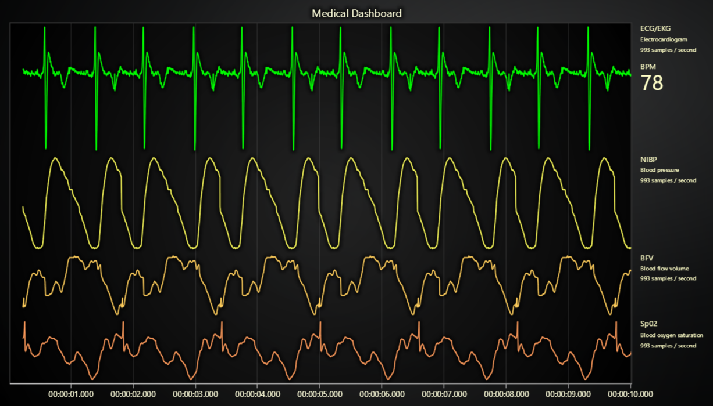

# JavaScript Medical Dashboard

This demo application belongs to the set of examples for LightningChart JS, data visualization library for JavaScript.

LightningChart JS is entirely GPU accelerated and performance optimized charting library for presenting massive amounts of data. It offers an easy way of creating sophisticated and interactive charts and adding them to your website or web application.

The demo can be used as an example or a seed project. Local execution requires the following steps:

-   Make sure that relevant version of [Node.js](https://nodejs.org/en/download/) is installed
-   Open the project folder in a terminal:

          npm install              # fetches dependencies
          npm start                # builds an application and starts the development server

-   The application is available at _http://localhost:8080_ in your browser, webpack-dev-server provides hot reload functionality.

## Description

A medical dashboard example with LightningChart JS.

Includes real-time visualization of four data channels:

-   ECG/EKG | electrocardiogram
-   NIBP | Non-invasive blood pressure measurement
-   BFV | Blood flow volume
-   Sp02 | Blood oxygen saturation

This application has 4 channels each with ~1000 Hz sample rate, adding up to a total of 4 000 data samples per second.

For LightningChart, this is on the low end of performance capabilities.
In 2021, the LightningChart team hosted several comparison studies on web charts performance, one of which was directly targeted at [scrolling multichannel line charts](https://lightningchart.com/javascript-charts-performance-comparison/) - exactly this type of application.

The results were shocking, with LightningChart being over 700 times faster than your average "high performance" competitor and being able to handle up to 10 000 000 data points per second while keeping display refresh rate over 30 (which is a very good refresh rate).

In the context of Medical Dashboards, this would mean that you could even monitor up to 10 000 data sources simultaneously, and/or greatly increase the data precision!

## API Links

* [Dashboard]
* [XY cartesian chart]
* [Line series]
* [Axis]
* [Axis tick strategies]
* [Axis scroll strategies]
* [UI position origins]
* [UI layout builders]
* [UI element builders]
* [Solid FillStyle]
* [HEX color factory]
* [Solid LineStyle]
* [Synchronize axis intervals]

## Support

If you notice an error in the example code, please open an issue on [GitHub][0] repository of the entire example.

Official [API documentation][1] can be found on [LightningChart][2] website.

If the docs and other materials do not solve your problem as well as implementation help is needed, ask on [StackOverflow][3] (tagged lightningchart).

If you think you found a bug in the LightningChart JavaScript library, please contact support@lightningchart.com.

Direct developer email support can be purchased through a [Support Plan][4] or by contacting sales@lightningchart.com.

[0]: https://github.com/Arction/
[1]: https://lightningchart.com/lightningchart-js-api-documentation/
[2]: https://lightningchart.com
[3]: https://stackoverflow.com/questions/tagged/lightningchart
[4]: https://lightningchart.com/support-services/

© LightningChart Ltd 2009-2022. All rights reserved.

[Dashboard]: https://lightningchart.com/js-charts/api-documentation/v4.2.0/classes/Dashboard.html
[XY cartesian chart]: https://lightningchart.com/js-charts/api-documentation/v4.2.0/classes/ChartXY.html
[Line series]: https://lightningchart.com/js-charts/api-documentation/v4.2.0/classes/LineSeries.html
[Axis]: https://lightningchart.com/js-charts/api-documentation/v4.2.0/classes/Axis.html
[Axis tick strategies]: https://lightningchart.com/js-charts/api-documentation/v4.2.0/variables/AxisTickStrategies.html
[Axis scroll strategies]: https://lightningchart.com/js-charts/api-documentation/v4.2.0/variables/AxisScrollStrategies.html
[UI position origins]: https://lightningchart.com/js-charts/api-documentation/v4.2.0/variables/UIOrigins.html
[UI layout builders]: https://lightningchart.com/js-charts/api-documentation/v4.2.0/variables/UILayoutBuilders.html
[UI element builders]: https://lightningchart.com/js-charts/api-documentation/v4.2.0/variables/UIElementBuilders.html
[Solid FillStyle]: https://lightningchart.com/js-charts/api-documentation/v4.2.0/classes/SolidFill.html
[HEX color factory]: https://lightningchart.com/js-charts/api-documentation/v4.2.0/functions/ColorHEX.html
[Solid LineStyle]: https://lightningchart.com/js-charts/api-documentation/v4.2.0/classes/SolidLine.html
[Synchronize axis intervals]: https://lightningchart.com/js-charts/api-documentation/v4.2.0/functions/synchronizeAxisIntervals.html

